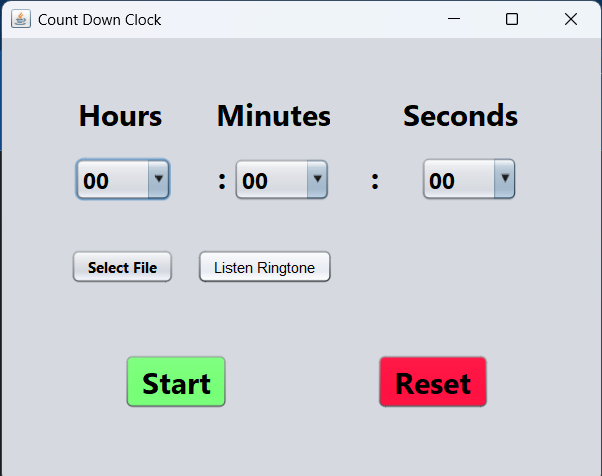

# ⏰ CountDown Clock - Java Alarm Timer


A feature-rich countdown timer application with MP3 alarm support. Includes ready-to-use executables for Windows (`exe`) and cross-platform (`jar`) versions.
Made in 2nd Sem of Super 30 Programme in MIT Acdademy of Engineering



## 🚀 Quick Start (For End Users)

Pre-built versions available in the `dist/` folder:

### For Windows Users
1. Download the repository
2. Navigate to `CountDownClock/dist/` folder
3. Double-click `CountDownClock.exe`

### For All Platforms (Requires Java)
```bash
java -jar CountDownClock/dist/CountDownClock.jar
